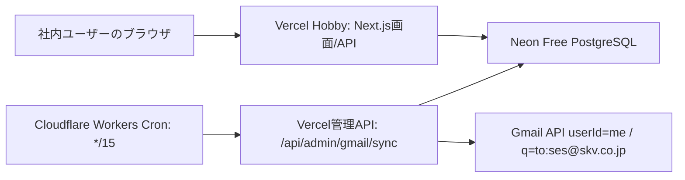
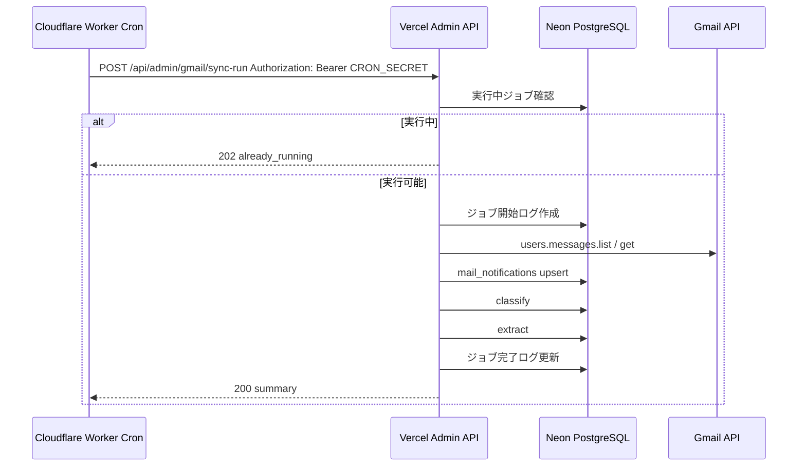

# SES Console 公開準備設計書 v0.2

作成日: 2026-05-11

## 1. この設計書の位置づけ

この設計書は、社内メンバーが SES Console を見られる状態にする前の公開準備方針を整理するものです。

まだ本番デプロイは行いません。コード変更、DB変更、Gmail同期API実装、ログイン実装、Cloudflare Worker実装もこの段階では行いません。

v0.1では公開前の一般的な安全確認を整理しました。v0.2では、以下の低コスト構成を前提に、実際の公開準備手順とリスクを具体化します。

## 2. 確定した方針

### 2.1 Gmail取得アカウント

当面は `sho.sato@skv.co.jp` をOAuth認証アカウントとして使います。

ただし、取得対象はあくまで `sho.sato@skv.co.jp` のGmail上で見えている `ses@skv.co.jp` 宛メールです。

```text
GMAIL_AUTH_USER=sho.sato@skv.co.jp
GMAIL_USER_ID=me
GMAIL_QUERY=to:ses@skv.co.jp
```

`ses@skv.co.jp` はGoogleグループであり、OAuth認証対象にはしません。

### 2.2 ログイン方針

理想はGoogle Workspaceログインですが、最短で社内公開する場合はメールアドレスとパスワードによるログインを第一候補にします。

最低限必要な機能:

- メールアドレスとパスワードでログイン
- パスワードハッシュ保存
- パスワードリセットメール送信
- リセットURLの有効期限
- ログインユーザーの有効/無効
- `users.role` による権限制御

Googleログインは大きく難しい実装ではありませんが、Google Cloud側のOAuthクライアント、同意画面、承認済みリダイレクトURI、ドメイン設定が必要です。ログインだけで `openid email profile` 程度の非センシティブスコープに留めるなら、通常はGmail読み取りスコープより軽いです。ただしGoogle側の設定状況や組織ポリシー次第で確認作業が発生します。

このため初期公開ではメール/パスワード方式を採用し、将来Google Workspaceログインへ切り替えられる設計にします。

### 2.3 権限方針

`MANAGER` にGmail同期・分類・抽出権限を持たせることは可能とします。

ただし、以下を前提にします。

- Gmail API scopeは `gmail.readonly` のみ
- Gmail側の削除、既読化、ラベル変更、返信、送信は行わない
- 同期・分類・抽出はDBへの作成/更新のみ
- 物理削除は実装しない
- 実行者、実行日時、件数、失敗内容をログに残す
- 二重実行を防ぐ
- 一覧は勝手にリロードせず、ユーザー操作で反映する

## 3. 推奨構成

第一方針はコストをかけないことです。

推奨構成:

| 用途 | サービス | プラン想定 |
|---|---|---|
| 画面/API | Vercel | Hobby |
| PostgreSQL | Neon | Free |
| 15分自動更新 | Cloudflare Workers Cron | Free |
| 手動更新 | SES Console画面上の更新ボタン | Vercel API |
| Gmail同期・分類・抽出 | Vercelの管理API | `CRON_SECRET` / ログイン権限で保護 |

構成イメージ:



## 4. 無料枠の前提

無料枠の条件は変更される可能性があります。公開前に各サービスの最新条件を再確認します。

### 4.1 Vercel Hobby

- Vercel CronはHobbyでも使えますが、Hobbyでは1日1回制限です。
- 15分ごとのCronはVercel Hobby単体では不可とします。
- Vercel FunctionsのHobby最大実行時間は、Fluid Compute有効時で最大5分が目安です。
- そのため、15分更新はCloudflare Workers CronからVercel APIを呼びます。
- Vercel API側は5分以内に終わるよう、Gmail同期件数を制限します。

### 4.2 Neon Free

- Neon Freeは無料でPostgreSQLを使えます。
- ただしストレージやcomputeには上限があります。
- Gmail本文を長期保存するため、メール数と本文サイズが増えるとFree枠を超える可能性があります。
- Vercelのようなサーバーレス環境からは、Neonのpooled connectionを使う方針にします。
- Prisma CLIのmigrationにはdirect connectionを使う方針にします。

### 4.3 Cloudflare Workers Cron Free

- Cloudflare Workers Cronで `*/15 * * * *` のような15分間隔実行を行います。
- CronはUTC基準です。
- Free planにはリクエスト数、CPU時間、Cron Trigger数などの制限があります。
- Workerでは重い処理をせず、Vercelの管理APIを叩くだけにします。

## 5. 使うサービス

### 5.1 Vercel

役割:

- Next.js画面のホスティング
- API Routeの実行
- 手動更新APIの受け口
- Cloudflare Cronから呼ばれる同期APIの受け口

VercelではGmail同期そのものを実行しますが、長時間処理にしないため、差分/上限件数つきで実行します。

### 5.2 Neon

役割:

- PostgreSQL本番DB
- 検証DB/branch
- pooled connectionによるサーバーレス接続

DBは以下に分けます。

| 環境 | 用途 |
|---|---|
| local | 個人開発 |
| staging | デプロイ前確認 |
| production | 社内公開用 |

### 5.3 Cloudflare Workers Cron

役割:

- 15分ごとにVercelの同期APIを呼ぶ
- `CRON_SECRET` をヘッダーに付けてサーバー間認証する
- Worker内ではDBやGmailに直接触らない

## 6. 環境変数一覧

### 6.1 Vercel側

| 環境変数 | 用途 | 備考 |
|---|---|---|
| `DATABASE_URL` | Neon pooled connection | アプリ実行用 |
| `DIRECT_URL` | Neon direct connection | migration用。アプリ実行では使わない |
| `GMAIL_AUTH_USER` | OAuth認証アカウント | 当面 `sho.sato@skv.co.jp` |
| `GMAIL_USER_ID` | Gmail API userId | `me` |
| `GMAIL_QUERY` | Gmail検索条件 | `to:ses@skv.co.jp` |
| `GMAIL_SYNC_FROM` | 同期開始日 | 初期は `2026-03-01` |
| `GMAIL_SYNC_PAGE_SIZE` | 1ページ取得件数 | 50から200程度で開始 |
| `GMAIL_SYNC_MAX_RESULTS` | 1回の最大取得件数 | 100から500程度で開始 |
| `GMAIL_CLASSIFY_LIMIT` | 1回の分類上限 | 必要に応じて設定 |
| `GMAIL_EXTRACT_LIMIT` | 1回の抽出上限 | 必要に応じて設定 |
| `GMAIL_CLIENT_ID` | Gmail OAuth client id | 本番ではJSONファイルではなくenv |
| `GMAIL_CLIENT_SECRET` | Gmail OAuth client secret | secret扱い |
| `GMAIL_REFRESH_TOKEN` | Gmail OAuth refresh token | secret扱い |
| `GMAIL_REDIRECT_URI` | Gmail OAuth redirect URI | 必要な場合のみ。env構成では既定値あり |
| `CRON_SECRET` | Cloudflare Cron認証 | WorkerとVercelで同一 |
| `ADMIN_SECRET` | 管理APIの緊急/運用用secret | ブラウザには出さない |
| `AUTH_SECRET` | ログインセッション署名 | 実装時に生成 |
| `APP_URL` / `APP_BASE_URL` | アプリURL | password reset URL生成用。実装は両方に対応 |
| `SMTP_HOST` | password resetメール送信用 | メール/パスワード方式で必要 |
| `SMTP_PORT` | SMTP port | 同上 |
| `SMTP_SECURE` | SMTP TLS接続 | `true` の場合465等のTLS接続 |
| `SMTP_STARTTLS` | STARTTLS制御 | 未指定時はSTARTTLSを試行。`false` で無効化 |
| `SMTP_HELO_HOST` | SMTP HELO名 | 未指定時は `localhost` |
| `SMTP_USER` | SMTP user | 同上 |
| `SMTP_PASSWORD` | SMTP password | secret扱い |
| `MAIL_FROM` | 送信元メールアドレス | password reset用 |
| `PASSWORD_RESET_TOKEN_TTL_MINUTES` | リセットURL有効期限 | 例: 30 |

### 6.2 Neon側

| 項目 | 用途 |
|---|---|
| Production database | 社内公開用DB |
| Staging database/branch | デプロイ前確認 |
| Pooled connection string | Vercel runtime用 `DATABASE_URL` |
| Direct connection string | migration用 `DIRECT_URL` |
| DB role | app用とmigration用を分けるのが理想 |
| Backup/restore | Free枠で可能な範囲を確認 |

### 6.3 Cloudflare Worker側

| 環境変数 | 用途 |
|---|---|
| `SES_CONSOLE_SYNC_URL` | Vercel同期API URL |
| `CRON_SECRET` | Vercel API認証用secret |

## 7. Vercel側の設定項目

- GitHubリポジトリ連携
- Framework: Next.js
- Build Command: `npm.cmd run build` 相当。ただしVercelでは通常 `npm run build`
- 本番環境変数をVercel Dashboardに設定
- `DATABASE_URL` はNeon pooled connection
- `DIRECT_URL` はmigration専用
- 本番では `seed` を実行しない
- 本番では `migrate reset` を実行しない
- Gmail OAuth JSONファイルは置かない
- Gmail OAuth情報はenvから読む設計に変更する
- 同期APIはNode.js runtimeで動かす
- 同期APIは5分以内に終わるようにする

## 8. Neon側の設定項目

- Project作成
- production branch/database作成
- staging branch/database作成
- pooled connection string取得
- direct connection string取得
- Vercel環境変数へ反映
- migration実行はdirect connectionを使用
- 本番データにseedを流さない
- Free枠のストレージ使用量を定期確認する

注意:

Gmail本文を保存し続ける方針のため、Neon Freeのストレージ上限に早く到達する可能性があります。公開前に、現在の `mail_notifications` 件数と本文サイズから概算容量を確認する必要があります。

## 9. Cloudflare Worker側の設定項目

Workerの役割は、15分おきにVercel同期APIを叩くだけです。

Cron:

```text
*/15 * * * *
```

Workerが行う処理:

1. `SES_CONSOLE_SYNC_URL` に `POST`
2. `Authorization: Bearer ${CRON_SECRET}` を付与
3. bodyに実行元 `source=cloudflare-cron` を付与
4. レスポンスのstatusとsummaryをログに出す

Workerが行わないこと:

- Gmail APIを直接叩かない
- DBへ直接接続しない
- Gmail tokenを持たない
- 抽出ロジックを持たない

## 10. 15分Cronの設計

### 10.1 基本フロー



### 10.2 タイムアウト対策

- 1回の同期上限を設ける
- 初期値は `GMAIL_SYNC_MAX_RESULTS=100` から開始
- 安定後に `200`、`500` へ上げる
- APIの実行時間を4分以内に収める
- 1回で全件を取り切ろうとしない
- `mail_notifications` はGmail `message.id` でupsertする
- `gmail:extract` は既存の重複防止を維持する
- 将来的にはGmail `historyId` 差分同期へ移行する

### 10.3 同時実行防止

公開前に、以下のどちらかを実装します。

推奨:

- `mail_sync_runs` と `job_locks` 相当のテーブルを追加
- `jobName = gmail_sync_pipeline` の実行中レコードがある場合は新規実行しない
- 一定時間を超えたロックは期限切れ扱いにする

代替:

- PostgreSQL advisory lockを使う

ただし、Neon pooled connectionやserverless環境では長時間ロックの扱いを慎重にする必要があるため、DBテーブルによるlease方式を推奨します。

## 11. 手動更新APIの設計

### 11.1 画面上の手動更新

SES Console画面に管理者/許可ロール向けの「メール同期」ボタンを置きます。

動作:

1. ログイン済みユーザーがボタンを押す
2. APIがユーザーのroleを確認する
3. `ADMIN` または許可された `MANAGER` のみ実行可能
4. Cronと同じ同期APIを呼ぶ
5. 実行中なら「同期中です」と表示
6. 完了したら「新着データがあります。表示を更新しますか」と通知
7. 一覧は自動でリロードしない

### 11.2 API認証

同じAPIをCronと手動で使います。

| 呼び出し元 | 認証方法 |
|---|---|
| Cloudflare Worker Cron | `Authorization: Bearer CRON_SECRET` |
| 画面の手動更新 | ログインセッション + role |
| 緊急運用 | `ADMIN_SECRET`。ブラウザには出さない |

`ADMIN_SECRET` はクライアントJavaScriptに渡しません。ブラウザからsecretを送らせる方式は禁止です。

### 11.3 実装状況

2026-05-12 時点で、local環境に以下を実装済みです。

- `POST /api/admin/gmail/sync-run`
- `GET /api/admin/gmail/sync-runs`
- `GET /api/admin/gmail/sync-runs/latest`
- `job_locks` によるDB lease方式の二重実行防止
- `mail_sync_runs` による同期・分類・抽出の実行ログ
- `ADMIN` / `MANAGER` の画面手動同期ボタン

local実HTTPでは、未ログイン401、`SALES` / `VIEWER` 403、`ADMIN` / `MANAGER` 200、Cron/Admin secret 200、ロック中の `202 already_running` を確認済みです。

staging移管時は、Vercel環境変数に `CRON_SECRET` / `ADMIN_SECRET` を設定し、Cloudflare Worker Cronから同じAPIを呼ぶ確認が必要です。

## 12. セキュリティ対策

### 12.1 Gmail

- Gmail scopeは `gmail.readonly` のみ
- Gmail削除なし
- 既読化なし
- ラベル操作なし
- 返信なし
- 送信なし
- 添付保存なし
- `sho.sato@skv.co.jp` のtokenをVercel環境変数に保存
- tokenをログに出さない

### 12.2 API

- 同期APIは認証必須
- Cronは `CRON_SECRET`
- 手動更新はログインrole
- secretは定期的にローテーション可能にする
- 同期APIのレスポンスにsecretや本文全文を返さない
- 実行者、実行元、件数、エラーをログ化

### 12.3 DB

- 本番DBで物理削除をしない
- `migrate reset` 禁止
- seed禁止
- migrationはdirect connectionで管理者のみ
- app runtimeはpooled connectionを使う
- 本番DBユーザーの権限を最小化

### 12.4 UI

- 案件/要員/未分類タブを主軸にする
- HR / FINANCE / MARKETING / 管理部採用などのタブは、UIとして残る場合があっても検索・分類・案件管理ロジックには使わない
- 同期完了時に一覧を勝手にリロードしない
- 編集中のユーザーに影響が出ないようにする

## 13. デプロイ手順

### 13.1 事前準備

1. 本番用Neon projectを作る
2. staging branch/databaseを作る
3. production branch/databaseを作る
4. pooled/direct connection stringを取得する
5. Vercel projectを作る
6. Vercel環境変数を設定する
7. Cloudflare Workerを作る
8. Cloudflare Workerに `SES_CONSOLE_SYNC_URL` と `CRON_SECRET` を設定する

### 13.2 DB移行

1. ローカル/検証でmigration状態を確認
2. 本番DBに `prisma migrate deploy` を実行
3. 本番ではseedしない
4. `prisma migrate reset` は実行しない
5. Prisma Studioで本番DBを直接編集しない

### 13.3 Gmail token移行

1. ローカルで `sho.sato@skv.co.jp` のOAuth認証を完了
2. `secrets/gmail-token.json` からrefresh tokenを取り出す
3. Vercelの `GMAIL_REFRESH_TOKEN` に登録
4. OAuth client id/secretもVercel環境変数へ登録
5. 本番では `secrets/gmail-oauth-client.json` を使わない
6. 本番APIでGmail取得テストを少量実行

### 13.4 Vercelデプロイ

1. GitHub連携
2. Vercel環境変数を設定
3. build確認
4. `/` の画面表示確認
5. ログイン確認
6. 案件/要員/未分類表示確認
7. 手動同期ボタン確認
8. 同期後に勝手に一覧が切り替わらないことを確認

### 13.5 Cloudflare Cron設定

1. Workerを作成
2. `*/15 * * * *` を設定
3. secretを設定
4. 手動実行でVercel API疎通確認
5. Cron Eventsで実行履歴確認
6. Vercel側のジョブログ確認

## 14. 運用手順

### 14.1 通常運用

- 15分ごとにCloudflare Cronが同期APIを呼ぶ
- 同期APIはGmail保存、分類、抽出を少量ずつ実行する
- 新着があれば画面に通知する
- ユーザーが更新ボタンを押したときだけ一覧を再取得する

### 14.2 手動更新

1. 管理者または許可されたマネージャーがログイン
2. メール同期ボタンを押す
3. 実行中なら待つ
4. 完了後に件数サマリを確認
5. 必要に応じて一覧を更新

### 14.3 エラー時

確認順:

1. Vercel Function logs
2. 同期ジョブログ
3. Cloudflare Worker logs / Cron Events
4. Neon接続状態
5. Gmail token失効有無
6. Gmail API quota

### 14.4 token失効時

1. ローカルで再OAuth認証
2. 新しいrefresh tokenを取得
3. Vercel環境変数を更新
4. 手動同期で確認
5. 古いtokenを破棄

## 15. リスクと注意点

| リスク | 内容 | 対策 |
|---|---|---|
| Vercel Hobby timeout | 同期APIが長すぎると失敗する | 1回の件数を制限する |
| Neon Free storage | Gmail本文保存で容量が増える | 使用量監視、bodyHtml保存方針見直し |
| Neon cold start | Free computeがidleから復帰すると遅い | 手動/cronで定期アクセス、リトライ |
| Cloudflare Worker制限 | Free planのCPU/requests制限 | Workerはfetchだけにする |
| token依存 | `sho.sato@skv.co.jp` token失効で止まる | 再認証手順、将来専用アカウント |
| 同期二重実行 | Cronと手動が重なる | job lock / lease |
| 誤分類 | ルール分類の限界 | 未分類/要確認導線、手動移動 |
| 本番DB事故 | seed/reset/migrationミス | 禁止手順、direct/pooled分離 |
| secret漏えい | refresh tokenやsecret流出 | env管理、ログ非表示、rotation |
| 無料枠変更 | サービス側の条件変更 | 公開前と月次で確認 |

## 16. 実装状況と残タスク

2026-05-12時点で、local確認まで完了したものと、staging以降で確認するものを分けて管理する。

| 優先度 | タスク | 状態 | 内容 |
|---|---|---|---|
| 1 | ログイン実装 | local PASS | メール/パスワード、パスワードリセットメール |
| 2 | role制御 | local PASS | `ADMIN` / `MANAGER` / `SALES` / `VIEWER` |
| 3 | Gmail token env化 | local PASS | Vercel staging/productionでは `secrets/*.json` を読まずenvから読む |
| 4 | production guard | local PASS | seed / Gmail同期・分類・抽出系CLIをproduction相当で拒否 |
| 5 | 同期管理API | local PASS | Cron/手動共通API |
| 6 | job lock | local PASS | 同時実行防止 |
| 7 | sync run logs | local PASS | 実行ログとエラー追跡 |
| 8 | 手動更新ボタン | local PASS | 権限つきで画面から実行 |
| 9 | Cloudflare Worker | 未実装 | 15分Cron。staging APIに対して先に確認 |
| 10 | Neon移行検証 | 未実施 | stagingでmigration確認 |
| 11 | Vercel deploy検証 | 未実施 | staging URLで動作確認 |

## 17. staging前にまだ変更しないもの

2026-05-12時点で、認証/RBAC、管理同期API、job lock、sync run logs、production guard、Gmail OAuth env化はlocal実装済み。次のstaging準備まで、以下はまだ本番向け変更を行わない。

- Vercel production設定
- Cloudflare Worker本体
- production DB接続
- production向けseed実行
- production向けmigration実行
- Gmail送信、既読化、ラベル操作、添付保存
- AI分類 / AI抽出

## 18. 参照した公式情報

- Vercel Cron Jobs usage and pricing: https://vercel.com/docs/cron-jobs/usage-and-pricing
- Vercel Functions limits: https://vercel.com/docs/functions/limitations
- Neon pricing: https://neon.com/pricing
- Neon with Prisma: https://docs.prisma.io/docs/v6/orm/overview/databases/neon
- Cloudflare Workers Cron Triggers: https://developers.cloudflare.com/workers/configuration/cron-triggers/
- Cloudflare Workers limits: https://developers.cloudflare.com/workers/platform/limits/
- Google OAuth verification help: https://support.google.com/cloud/answer/13463073

## 19. ユーザー判断反映済み事項

以下は確認待ちではなく、公開準備の確定方針として扱う。

1. 初期ログイン方式はメール/パスワード方式で進める。Google Workspaceログインは将来候補とする。
2. パスワードリセットは必須とし、送信元は `MAIL_FROM`、SMTP設定は環境変数で管理する。secret値はMarkdownやログに出さない。
3. `MANAGER` には手動同期・分類・抽出を許可する。ただしGmail API scopeは `gmail.readonly` のみとし、削除、既読化、ラベル操作、返信、送信、添付保存は行わない。
4. `SALES` は案件/要員の作成・編集、未分類から案件/要員への移動を可能とする。ただしGmail同期・分類・抽出は実行不可とする。
5. 本番公開前に必ずstaging環境を作り、Neon staging database/branch と Vercel staging deploy でmigration、ログイン、一覧表示、同期APIを確認する。
6. Neon Free容量不足時は、まず使用量を確認し、bodyHtml保存制限または有料化を検討する。
7. Gmail取得アカウントは当面 `sho.sato@skv.co.jp` を使う。`ses@skv.co.jp` はGoogleグループでありOAuth認証対象にしない。将来の専用取得アカウントは検討事項とするが、移管前検証のブロッカーにはしない。
8. 同期エラー通知は初期方針としてADMINロール向けにし、通知先は `ADMIN_EMAILS` または将来の通知設定で差し替え可能にする。
9. Cloudflare / Vercel / Neon 管理者は複数名を推奨し、退職・異動時の権限移譲とtoken再発行手順を運用手順に含める。
10. パスワードポリシーは最低12文字、ハッシュ保存、reset URL有効期限30分、`users.isActive=false` のログイン不可、reset token非平文保存・ログ非表示を初期推奨とする。
